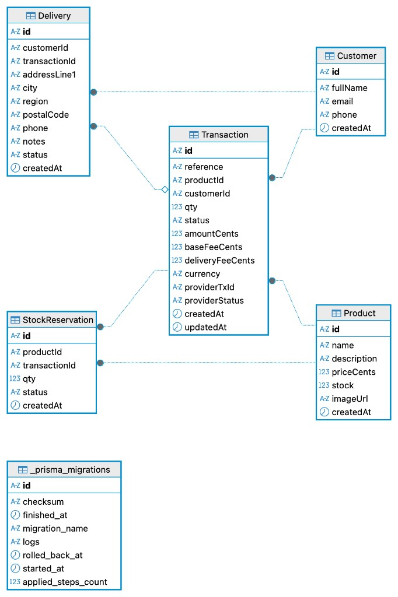

# payment-checkout-app

## Español

Checkout de invitado (sin login): catálogo, pago con tarjeta en sandbox, reserva de stock y entrega. Monorepo npm workspaces: API NestJS + web Vite/React + PostgreSQL.

### Demo (AWS)

| Qué | URL |
|-----|-----|
| Frontend | https://d302q7p7lf2y41.cloudfront.net |
| API | https://d1aoysjwqe9rtj.cloudfront.net |
| Health | https://d1aoysjwqe9rtj.cloudfront.net/health |
| Swagger | https://d1aoysjwqe9rtj.cloudfront.net/docs |

**Arquitectura:** SPA en S3 + CloudFront · API Nest (Docker) en EC2 + CloudFront (HTTPS) · RDS PostgreSQL 16.

**Fees (servidor, centavos COP):** base `500_000` ($5.000) + domicilio `800_000` ($8.000).

**Webhook sandbox:** `POST https://d1aoysjwqe9rtj.cloudfront.net/webhooks/payments`

### Modelo de datos



- Stock disponible = `product.stock` − suma de reservas `ACTIVE`.
- `PENDING` → crea reserva `ACTIVE`.
- `APPROVED` → reserva `CONFIRMED` y descuenta `stock`.
- `DECLINED` / `ERROR` → reserva `RELEASED`.
- Sin PAN/CVV en base de datos. `_prisma_migrations` es tabla interna de Prisma.

Schema: `apps/api/prisma/schema.prisma`. Seed: `apps/api/prisma/seed.ts` (`npx prisma db seed`).

### Requisitos locales

- Node.js 22 (npm workspaces)
- Docker (opcional, Postgres local)

### Variables de entorno

Copia `.env.example` a `.env` y a `apps/api/.env`. En web: `apps/web/.env.example` → `apps/web/.env`.

| Variable | Uso |
|----------|-----|
| `DATABASE_URL` | PostgreSQL |
| `API_PORT` / `PORT` | Puerto API (Render/EC2: `PORT`) |
| `WEB_ORIGIN` | CORS, orígenes separados por coma |
| `PAYMENT_API_URL` | Base URL sandbox (enunciado) |
| `PAYMENT_PUBLIC_KEY` | Tokenización |
| `PAYMENT_PRIVATE_KEY` | Cobro en servidor |
| `PAYMENT_INTEGRITY_SECRET` | Firma integrity |
| `PAYMENT_EVENTS_SECRET` | Webhooks |
| `VITE_API_URL` | Solo web; se quema en el **build** |

No commitear secretos. No loguear tokens, PAN ni CVV.

### Base de datos (local)

```bash
docker compose up -d
```

PostgreSQL en `localhost:5433` → contenedor `:5432` (usuario/password/db: `checkout`).

### API (local)

```bash
npm install
cp .env.example .env && cp .env apps/api/.env
docker compose up -d
cd apps/api && npx prisma migrate deploy && npx prisma db seed && cd ../..
npm run dev:api
```

Health: `GET http://localhost:3000/health` → `{ "status": "ok" }`  
Swagger: http://localhost:3000/docs

Endpoints: `GET /products`, `GET /products/:id`, `POST /customers`, `POST /deliveries`, `POST /transactions`, `GET /transactions/:id`, `POST /transactions/:id/pay`, `POST /payments/card-tokens`, `POST /webhooks/payments`

**Cobertura (líneas, Jest):** API **98.27%** · web **97.05%** (`npm run test:cov:api` / `test:cov:web`). Umbral: ≥85%. En API se miden use cases, gateway sandbox y unwrap; no Prisma ni `main.ts`. En web, módulos TS (slice, card, api); no componentes TSX.

**Seguridad HTTP:** Helmet + CORS allowlist (`WEB_ORIGIN`) + CSP en el `index.html` de la SPA (más laxo en `vite dev` por HMR). HTTPS en CloudFront.

**npm audit:** avisos high transitivos (`prisma`/`deepmerge-ts`, `@nestjs/swagger`/`js-yaml`). No se aplicó `audit fix --force` (bajaba Prisma).

### Web (local)

```bash
cp apps/web/.env.example apps/web/.env
npm run dev:api   # otra terminal
npm run dev:web
```

http://localhost:5173 — listado → producto → checkout → resumen → procesamiento (polling) → resultado.

UI en español. Guest checkout. Refresh en el paso tarjeta: se piden de nuevo PAN/CVV (aviso de que no se guardan).

### Scripts

| Script | Descripción |
|--------|-------------|
| `npm run dev:api` | API watch |
| `npm run dev:web` | Frontend Vite |
| `npm run test:api` / `test:web` | Tests |
| `npm run test:cov:api` / `test:cov:web` | Coverage |
| `npm run build:api` / `build:web` | Build |

### Deploy (resumen)

- **Front:** `VITE_API_URL` → `npm run build -w apps/web` → subir `apps/web/dist/` a S3 → invalidar CloudFront `/*`.
- **API:** `docker build --platform linux/amd64` → ECR → en EC2 `docker pull` + `docker run` (migrate + seed al arrancar).
- Rama de integración: `development`. `main` es release.

---

## English

Guest checkout (no login): catalog, sandbox card payment, stock reservation, and delivery. npm workspaces monorepo: NestJS API + Vite/React web + PostgreSQL.

### Live demo (AWS)

| What | URL |
|------|-----|
| Frontend | https://d302q7p7lf2y41.cloudfront.net |
| API | https://d1aoysjwqe9rtj.cloudfront.net |
| Health | https://d1aoysjwqe9rtj.cloudfront.net/health |
| Swagger | https://d1aoysjwqe9rtj.cloudfront.net/docs |

**Architecture:** SPA on S3 + CloudFront · Nest API (Docker) on EC2 + CloudFront (HTTPS) · RDS PostgreSQL 16.

**Fees (server, COP cents):** base `500_000` ($5,000) + delivery `800_000` ($8,000).

**Sandbox webhook:** `POST https://d1aoysjwqe9rtj.cloudfront.net/webhooks/payments`

### Data model


- Available stock = `product.stock` minus `ACTIVE` reservations.
- `PENDING` → `ACTIVE` reservation.
- `APPROVED` → reservation `CONFIRMED` and `stock` decreases.
- `DECLINED` / `ERROR` → reservation `RELEASED`.
- No PAN/CVV in the database. `_prisma_migrations` is Prisma’s migration ledger.

Schema: `apps/api/prisma/schema.prisma`. Seed: `apps/api/prisma/seed.ts` (`npx prisma db seed`).

### Local requirements

- Node.js 22 (npm workspaces)
- Docker (optional, local Postgres)

### Environment

Copy `.env.example` to `.env` and `apps/api/.env`. Web: `apps/web/.env.example` → `apps/web/.env`.

| Variable | Role |
|----------|------|
| `DATABASE_URL` | PostgreSQL |
| `API_PORT` / `PORT` | API port |
| `WEB_ORIGIN` | CORS allowlist (comma-separated) |
| `PAYMENT_*` | Sandbox keys from the challenge brief |
| `VITE_API_URL` | Web only; baked in at **build** time |

Do not commit secrets. Do not log tokens, PAN, or CVV.

### Database (local)

```bash
docker compose up -d
```

PostgreSQL on `localhost:5433` → container `:5432` (user/password/db: `checkout`).

### API (local)

```bash
npm install
cp .env.example .env && cp .env apps/api/.env
docker compose up -d
cd apps/api && npx prisma migrate deploy && npx prisma db seed && cd ../..
npm run dev:api
```

Health: `GET http://localhost:3000/health` → `{ "status": "ok" }`  
Swagger: http://localhost:3000/docs

Endpoints: `GET /products`, `GET /products/:id`, `POST /customers`, `POST /deliveries`, `POST /transactions`, `GET /transactions/:id`, `POST /transactions/:id/pay`, `POST /payments/card-tokens`, `POST /webhooks/payments`

**Coverage (lines, Jest):** API **98.27%** · web **97.05%** (`npm run test:cov:api` / `test:cov:web`). Threshold: ≥85%. API: use cases, sandbox gateway, unwrap — not Prisma or `main.ts`. Web: TS modules (slice, card, api), not TSX components.

**HTTP security:** Helmet + CORS allowlist (`WEB_ORIGIN`) + CSP on the SPA `index.html` (looser in `vite dev` for HMR). HTTPS via CloudFront.

**npm audit:** leftover high findings are transitive (`prisma`/`deepmerge-ts`, `@nestjs/swagger`/`js-yaml`). Did not run `audit fix --force` (it would downgrade Prisma).

### Web (local)

```bash
cp apps/web/.env.example apps/web/.env
npm run dev:api   # other terminal
npm run dev:web
```

http://localhost:5173 — list → product → checkout → summary → processing (poll) → result.

UI in Spanish. Guest checkout. Card-step refresh: PAN/CVV are requested again (they are not stored).

### Scripts

| Script | Description |
|--------|-------------|
| `npm run dev:api` | API watch |
| `npm run dev:web` | Vite frontend |
| `npm run test:api` / `test:web` | Tests |
| `npm run test:cov:api` / `test:cov:web` | Coverage |
| `npm run build:api` / `build:web` | Build |

### Deploy (short)

- **Web:** set `VITE_API_URL` → `npm run build -w apps/web` → upload `apps/web/dist/` to S3 → CloudFront invalidation `/*`.
- **API:** `docker build --platform linux/amd64` → ECR → on EC2 `docker pull` + `docker run` (migrate + seed on boot).
- Integration branch: `development`. `main` is release.
